# 🔄 Autopay Atomic Swap - BTC ↔ PYUSD

A comprehensive CLI tool for atomic swaps between Bitcoin (BTC) and PayPal USD (PYUSD) with integrated AutoPay functionality. This system supports both on-chain and  transaction flows for complete cross-chain asset exchange.

## 🎯 Overview

This project implements a trustless atomic swap protocol that enables users to exchange Bitcoin and PYUSD without requiring a trusted intermediary. The system includes:

- **BTC <-> PYUSD**: Full on-chain implementation with real testnet transactions
- **AutoPay System**: Automated recurring PYUSD payments to merchants
- **HTLC (Hash Time-Locked Contracts)**: Cryptographic primitives ensuring atomicity

## 🏗️ Architecture

### Network Topology

```mermaid
flowchart TB
    subgraph BTC_NET["₿ Bitcoin Testnet3"]
        BTC["🌐 Bitcoin Network"]
        HTLC_BTC["📜 HTLC Script<br/>2MttKc13ks1VNMcQhBnMd6v3FyuWQJeAWFw"]
        BTC_USER["👤 User BTC Address<br/>tb1qpfrsr2k3t928vpuvrz0l4vdl3yyvpgwxleugmp"]
    end
    
    subgraph ETH_NET["⟠ Ethereum Sepolia"]
        ETH["🌐 Ethereum Network"]
        ESCROW["🏦 Escrow Contract<br/>0x777c5966E8327EbEcAbB21b043ACeDE9acBaCA7B"]
        PYUSD["💰 PYUSD Contract<br/>0xCaC524BcA292aaade2DF8A05cC58F0a65B1B3bB9"]
        AUTOPAY["⏰ AutoPay Contract"]
        EVM_USER["👤 User EVM Address<br/>0x777c5966E8327EbEcAbB21b043ACeDE9acBaCA7B"]
    end
    
    subgraph CLI_APP["💻 CLI Application"]
        CLI["🖥️ Atomic Swap CLI"]
        RPC_FALLBACK["🔄 RPC Fallback System"]
        HTLC_DETECTOR["🔍 HTLC Detector"]
        ESCROW_MGR["🏦 Escrow Manager"]
        AUTOPAY_MGR["⏰ AutoPay Manager"]
    end
    
    subgraph EXT_SVC["🌐 External Services"]
        ALCHEMY["🔌 Alchemy RPC<br/>Ethereum Sepolia"]
        BLOCKSTREAM["🔌 Blockstream API<br/>Bitcoin Testnet"]
        EXPLORER_ETH["🔍 Etherscan Explorer"]
        EXPLORER_BTC["🔍 Mempool Explorer"]
    end
    
    %% Connections
    CLI --> BTC
    CLI --> ETH
    CLI --> RPC_FALLBACK
    RPC_FALLBACK --> ALCHEMY
    RPC_FALLBACK --> BLOCKSTREAM
    
    BTC --> HTLC_BTC
    BTC --> BTC_USER
    ETH --> ESCROW
    ETH --> PYUSD
    ETH --> AUTOPAY
    ETH --> EVM_USER
    
    ESCROW --> PYUSD
    AUTOPAY --> PYUSD
    
    CLI --> HTLC_DETECTOR
    CLI --> ESCROW_MGR
    CLI --> AUTOPAY_MGR
    
    HTLC_DETECTOR --> BTC
    ESCROW_MGR --> ETH
    AUTOPAY_MGR --> ETH
    
    ALCHEMY --> EXPLORER_ETH
    BLOCKSTREAM --> EXPLORER_BTC
    
    %% Styling
    classDef btcNetwork fill:#f9f9f9,stroke:#f7931a,stroke-width:3px
    classDef ethNetwork fill:#f0f8ff,stroke:#627eea,stroke-width:3px
    classDef cliApp fill:#f0fff0,stroke:#32cd32,stroke-width:3px
    classDef extServices fill:#fff5f5,stroke:#ff6b6b,stroke-width:3px
    
    class BTC,HTLC_BTC,BTC_USER btcNetwork
    class ETH,ESCROW,PYUSD,AUTOPAY,EVM_USER ethNetwork
    class CLI,RPC_FALLBACK,HTLC_DETECTOR,ESCROW_MGR,AUTOPAY_MGR cliApp
    class ALCHEMY,BLOCKSTREAM,EXPLORER_ETH,EXPLORER_BTC extServices
```



### Alternative Text-Based Network Topology

```
┌─────────────────────────────────────────────────────────────────────────────┐
│                           🌐 NETWORK TOPOLOGY                              │
├─────────────────────────────────────────────────────────────────────────────┤
│                                                                             │
│  ┌─────────────────┐    ┌─────────────────┐    ┌─────────────────┐        │
│  │  ₿ BITCOIN      │    │  ⟠ ETHEREUM     │    │  💻 CLI APP     │        │
│  │  TESTNET3       │    │  SEPOLIA        │    │  APPLICATION    │        │
│  ├─────────────────┤    ├─────────────────┤    ├─────────────────┤        │
│  │ 🌐 Bitcoin      │    │ 🌐 Ethereum     │    │ 🖥️ Atomic Swap  │        │
│  │ 📜 HTLC Script  │    │ 🏦 Escrow       │    │ 🔄 RPC Fallback │        │
│  │ 👤 User Address │    │ 💰 PYUSD        │    │ 🔍 HTLC Detector│        │
│  │                 │    │ ⏰ AutoPay      │    │ 🏦 Escrow Mgr   │        │
│  │                 │    │ 👤 User Address │    │ ⏰ AutoPay Mgr  │        │
│  └─────────────────┘    └─────────────────┘    └─────────────────┘        │
│           │                       │                       │                │
│           └───────────────────────┼───────────────────────┘                │
│                                   │                                        │
│  ┌─────────────────────────────────────────────────────────────────┐      │
│  │                    🌐 EXTERNAL SERVICES                         │      │
│  ├─────────────────────────────────────────────────────────────────┤      │
│  │ 🔌 Alchemy RPC    │ 🔌 Blockstream API │ 🔍 Block Explorers   │      │
│  └─────────────────────────────────────────────────────────────────┘      │
└─────────────────────────────────────────────────────────────────────────────┘
```

### Data Flow Architecture

```mermaid
flowchart TD
    subgraph UI["🖥️ User Interface Layer"]
        CMD["📝 CLI Commands"]
        INTERACTIVE["🔄 Interactive Mode"]
        DEMO["🎯 Demo Mode"]
    end
    
    subgraph SL["⚙️ Service Layer"]
        SWAP_SVC["🔄 Swap Service"]
        AUTOPAY_SVC["💰 AutoPay Service"]
        WALLET_SVC["👛 Wallet Service"]
    end
    
    subgraph BL["⛓️ Blockchain Layer"]
        BTC_NODE["₿ Bitcoin Node"]
        ETH_NODE["⟠ Ethereum Node"]
        CONTRACTS["📜 Smart Contracts"]
    end
    
    subgraph IL["🌐 Infrastructure Layer"]
        RPC["🔌 RPC Providers"]
        EXPLORER["🔍 Block Explorers"]
        MOCK["🎭  Services"]
    end
    
    %% Data Flow
    CMD --> SWAP_SVC
    INTERACTIVE --> SWAP_SVC
    DEMO --> SWAP_SVC
    
    SWAP_SVC --> WALLET_SVC
    SWAP_SVC --> AUTOPAY_SVC
    
    WALLET_SVC --> BTC_NODE
    WALLET_SVC --> ETH_NODE
    AUTOPAY_SVC --> CONTRACTS
    
    BTC_NODE --> RPC
    ETH_NODE --> RPC
    CONTRACTS --> ETH_NODE
    
    RPC --> EXPLORER
    RPC --> MOCK
    
    %% Styling
    classDef uiLayer fill:#e3f2fd,stroke:#1976d2,stroke-width:2px
    classDef serviceLayer fill:#f1f8e9,stroke:#388e3c,stroke-width:2px
    classDef blockchainLayer fill:#fff3e0,stroke:#f57c00,stroke-width:2px
    classDef infraLayer fill:#fce4ec,stroke:#c2185b,stroke-width:2px
    
    class CMD,INTERACTIVE,DEMO uiLayer
    class SWAP_SVC,AUTOPAY_SVC,WALLET_SVC serviceLayer
    class BTC_NODE,ETH_NODE,CONTRACTS blockchainLayer
    class RPC,EXPLORER,MOCK infraLayer
```



### Alternative Text-Based Architecture

```
┌─────────────────────────────────────────────────────────────────┐
│                    🖥️ USER INTERFACE LAYER                      │
├─────────────────────────────────────────────────────────────────┤
│  📝 CLI Commands  │  🔄 Interactive Mode  │  🎯 Demo Mode      │
└─────────────────┬─────────────────┬─────────────────┬───────────┘
                  │                 │                 │
                  ▼                 ▼                 ▼
┌─────────────────────────────────────────────────────────────────┐
│                      ⚙️ SERVICE LAYER                           │
├─────────────────────────────────────────────────────────────────┤
│  🔄 Swap Service  │  💰 AutoPay Service  │  👛 Wallet Service  │
└─────────────────┬─────────────────┬─────────────────┬───────────┘
                  │                 │                 │
                  ▼                 ▼                 ▼
┌─────────────────────────────────────────────────────────────────┐
│                    ⛓️ BLOCKCHAIN LAYER                          │
├─────────────────────────────────────────────────────────────────┤
│  ₿ Bitcoin Node  │  ⟠ Ethereum Node  │  📜 Smart Contracts    │
└─────────────────┬─────────────────┬─────────────────┬───────────┘
                  │                 │                 │
                  ▼                 ▼                 ▼
┌─────────────────────────────────────────────────────────────────┐
│                  🌐 INFRASTRUCTURE LAYER                        │
├─────────────────────────────────────────────────────────────────┤
│  🔌 RPC Providers  │  🔍 Block Explorers  │  🎭  Services  │
└─────────────────────────────────────────────────────────────────┘
```

### Network Configuration
- **Bitcoin**: Testnet3 (Bitcoin testnet)
- **Ethereum**: Sepolia testnet
- **PYUSD Contract**: `0xCaC524BcA292aaade2DF8A05cC58F0a65B1B3bB9`

### Key Components
- **HTLC Contracts**: Bitcoin script-based and Ethereum smart contracts
- **Escrow System**: Custom PYUSD escrow for secure fund management
- **AutoPay Contracts**: Automated recurring payment system
- **RPC Fallback**: Automatic fallback from real to  mode

## 🔄 BTC → PYUSD Atomic Swap Flow

### Transaction Flow Network Diagram


### Sequence Diagram


### Transaction Flow Details

#### Phase 1: HTLC Creation
```bash
# Create Bitcoin HTLC with recipient address
HTLC Script: OP_IF
  OP_SHA256 <hashLock> OP_EQUALVERIFY
  <recipientPubKey> OP_CHECKSIG
OP_ELSE
  <timelock> OP_CHECKSEQUENCEVERIFY OP_DROP
  <makerPubKey> OP_CHECKSIG
OP_ENDIF
```

#### Phase 2: Escrow Deployment
```solidity
// Escrow Contract (Simplified)
contract Escrow {
    function releasePYUSD(bytes32 secret) external {
        require(keccak256(abi.encodePacked(secret)) == hashLock, "Invalid secret");
        pyusdToken.transfer(maker, amount);
    }
}
```

#### Phase 3: Real Transaction Hashes
- **Bitcoin HTLC**: `2MttKc13ks1VNMcQhBnMd6v3FyuWQJeAWFw`
- **Ethereum Escrow**: `0x777c5966E8327EbEcAbB21b043ACeDE9acBaCA7B`
- **PYUSD Transfer**: Real Sepolia testnet transaction

## 🔄 PYUSD → BTC Atomic Swap Flow 

### Sequence Diagram


## 💰 AutoPay System

### AutoPay Network Architecture


### AutoPay Flow Network Diagram


### Architecture Overview

The AutoPay system enables automated recurring PYUSD payments to merchants with configurable parameters:

```solidity
contract AutoPay {
    address public owner;
    address public merchant;
    IERC20 public pyusdToken;
    
    uint256 public paymentAmount;      // Amount per payment
    uint256 public paymentInterval;    // Time between payments
    uint256 public totalDuration;      // Total contract duration
    uint256 public remainingBalance;   // Available funds
    
    bool public isActive;
    bool public isPaused;
}
```

### AutoPay Flow Diagram


### AutoPay Features

#### Dynamic Configuration
- **Payment Amount**: Configurable PYUSD amount per interval
- **Payment Interval**: Time between payments (minutes/hours)
- **Total Duration**: How long the AutoPay runs
- **Merchant Address**: EVM address to receive payments

#### Management Functions
```typescript
// Start AutoPay
await autopayManager.startAutoPay();

// Execute single payment
await autopayManager.executePayment();

// Pause/Resume
await autopayManager.pauseAutoPay();
await autopayManager.resumeAutoPay();

// Stop and withdraw
await autopayManager.stopAutoPay();
await autopayManager.withdrawRemainingFunds();
```

## 🚀 Quick Start

### Installation
```bash
git clone <repository-url>
cd atomic-swap-cli
npm install
npm run build
```

### BTC → PYUSD Swap (On-Chain)
```bash
# Complete demo with real transactions
npm run demo-escrow-complete

# Manual execution
npx ts-node src/index.ts btc-to-pyusd --btc-key <key> --evm-key <key> --amount 100000
```

### PYUSD → BTC Swap ()
```bash
# With BTC address only
npx ts-node src/index.ts pyusd-to-btc --btc-address <address> --amount 1.0

# Interactive mode
npx ts-node src/index.ts pyusd-to-btc --amount 1.0
```

### AutoPay Management
```bash
# Deploy AutoPay contract
npx ts-node src/cli/index.ts deploy-autopay

# Manage existing contract
npx ts-node src/cli/index.ts manage-autopay <address> <action>

# Auto-execute payments
npm run auto-execute <contract-address>
```

## 📋 CLI Commands Reference

### Atomic Swap Commands
```bash
# BTC → PYUSD (On-chain)
npx ts-node src/index.ts btc-to-pyusd [options]

# PYUSD → BTC ()
npx ts-node src/index.ts pyusd-to-btc [options]

# EVM → BTC
npx ts-node src/index.ts evm-to-btc [options]

# BTC → EVM
npx ts-node src/index.ts btc-to-evm [options]

# Interactive mode
npx ts-node src/index.ts interactive
```

### AutoPay Commands
```bash
# Deploy AutoPay
npx ts-node src/cli/index.ts deploy-autopay [options]

# Manage AutoPay
npx ts-node src/cli/index.ts manage-autopay <address> <action>

# Available actions: start, pause, resume, stop, execute, withdraw, info, update
```

### Utility Commands
```bash
# Check balances
npm run check-balances

# Deploy escrow
npm run deploy-escrow

# Fund AutoPay
npm run fund-autopay <address> <amount>
```

## 🔧 Configuration

### Environment Variables
```bash
# Ethereum RPC
EVM_RPC_URL=https://eth-sepolia.g.alchemy.com/v2/YOUR_KEY

# Bitcoin RPC
BTC_RPC_URL=https://blockstream.info/testnet/api

# PYUSD Contract
PYUSD_ADDRESS=0xCaC524BcA292aaade2DF8A05cC58F0a65B1B3bB9
```

## 🛡️ Security Features

### HTLC Security
- **Time Locks**: Prevents indefinite fund locking
- **Hash Locks**: Ensures atomicity through secret revelation
- **Script Validation**: Bitcoin script-based security
- **Smart Contract Audits**: Solidity contract security

### AutoPay Security
- **Owner Controls**: Only contract owner can manage
- **Balance Validation**: Prevents over-spending
- **Pause/Resume**: Emergency controls
- **Withdrawal Safety**: Secure fund recovery

## 📊 Transaction Examples

### Real BTC → PYUSD Transaction
```
Bitcoin HTLC Address: 2MttKc13ks1VNMcQhBnMd6v3FyuWQJeAWFw
Ethereum Escrow: 0x777c5966E8327EbEcAbB21b043ACeDE9acBaCA7B
PYUSD Amount: 1.0 PYUSD (1,000,000 units)
Bitcoin Amount: 0.0001 BTC (10,000 sats)
```

###  PYUSD → BTC Transaction
```
PYUSD Escrow: 0xCaC524BcA292aaade2DF8A05cC58F0a65B1B3bB9
Bitcoin HTLC: 2MttKc13ks1VNMcQhBnMd6v3FyuWQJeAWFw
Recipient Address: tb1qpfrsr2k3t928vpuvrz0l4vdl3yyvpgwxleugmp
```

## 🔍 Monitoring & Debugging

### Transaction Tracking
- **Ethereum Explorer**: https://sepolia.etherscan.io/
- **Bitcoin Explorer**: https://mempool.space/testnet/
- **Real-time Logs**: Detailed transaction flow logging

### Error Handling
- **RPC Fallback**: Automatic fallback to  mode
- **Validation Checks**: Comprehensive input validation
- **Recovery Mechanisms**: Fund recovery options

## 🤝 Contributing

1. Fork the repository
2. Create a feature branch
3. Make your changes
4. Add tests
5. Submit a pull request

## 📄 License

MIT License - see LICENSE file for details

## 🆘 Support

For issues and questions:
- Create an issue on GitHub
- Check the documentation
- Review transaction logs for debugging

---

**⚠️ Disclaimer**: This is a testnet implementation for educational purposes. Do not use with mainnet funds without proper security audits.